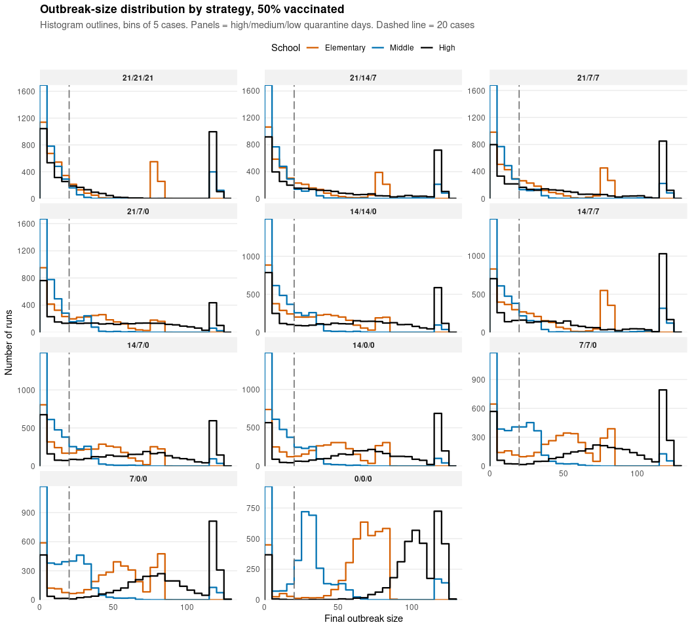
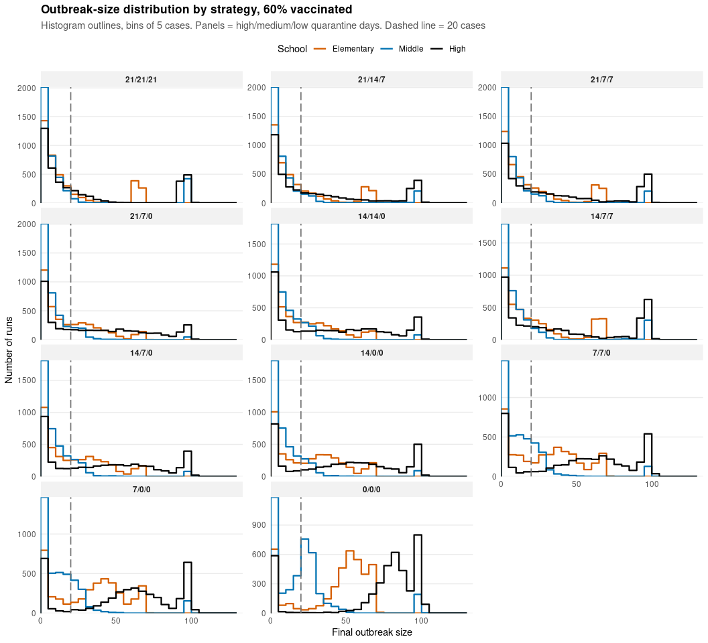
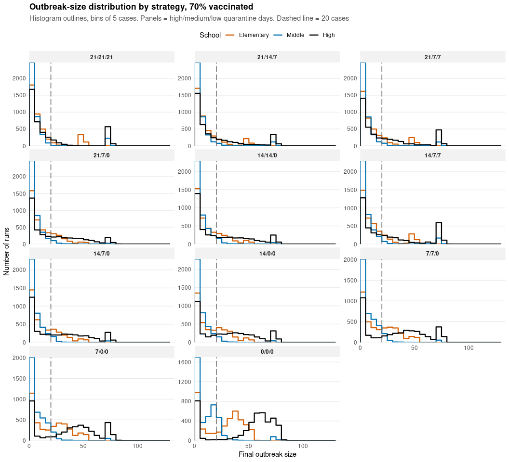
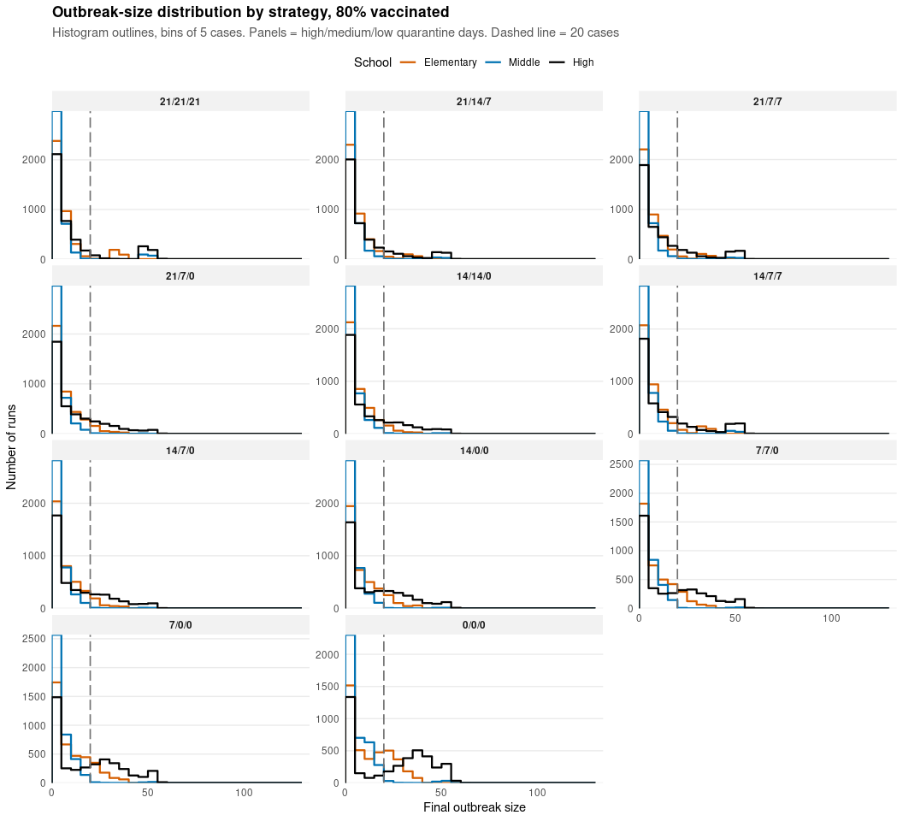
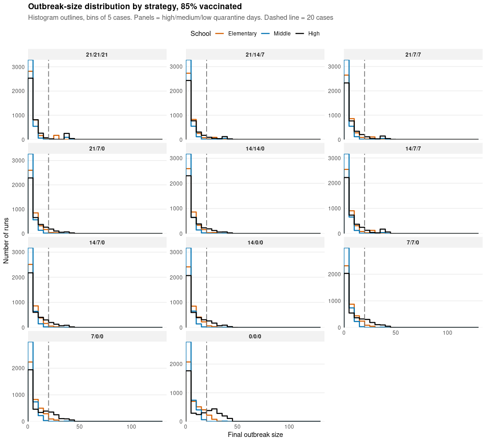

# 2. Outbreak-size distributions by quarantine strategy

- [Histograms, all schools](#histograms-all-schools)
- [50% vaccinated](#vaccinated)
- [60% vaccinated](#vaccinated-1)
- [70% vaccinated](#vaccinated-2)
- [80% vaccinated](#vaccinated-3)
- [85% vaccinated](#vaccinated-4)

How big do outbreaks get under each quarantine strategy? For every
vaccination level and one of 11 strategies (**high / medium / low-risk
quarantine days**), we look at the full distribution of final outbreak
sizes rather than a single probability.

- **Histograms** are drawn as outlines, one coloured line per school, so
  the three schools can be compared in the same panel. There is one
  panel per strategy and one graph per vaccination level.
- **Tables** give the probability of an outbreak of at least 10, 20 and
  50 cases, for each school and strategy.

> **Note**
>
> Model code lives in `measles_model.R`. Simulations are cached in
> `results/`, and PNG copies of every figure are saved to `figures/`.

## Histograms, all schools

::: {.panel-tabset}

## 50% vaccinated

## 60% vaccinated

## 70% vaccinated

## 80% vaccinated

## 85% vaccinated

