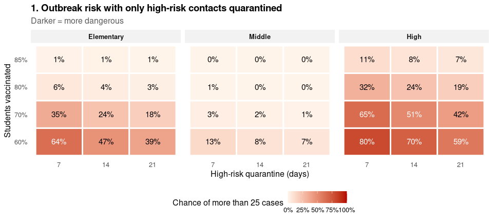
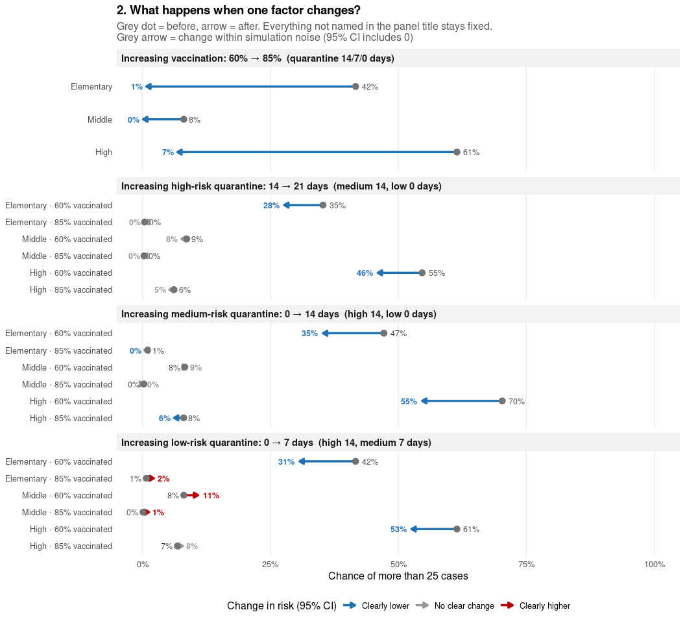
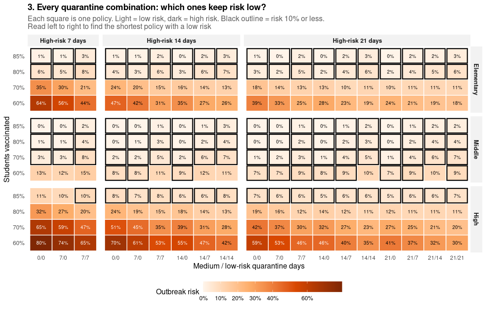
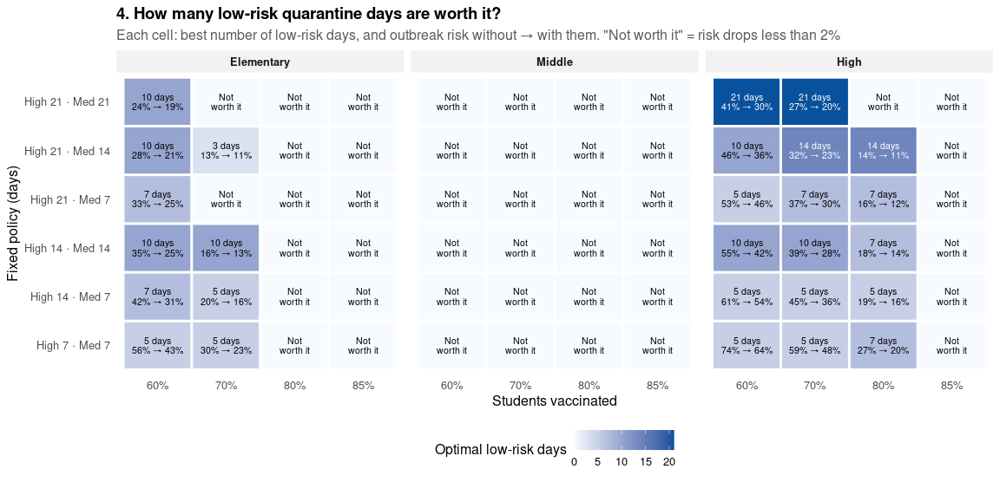
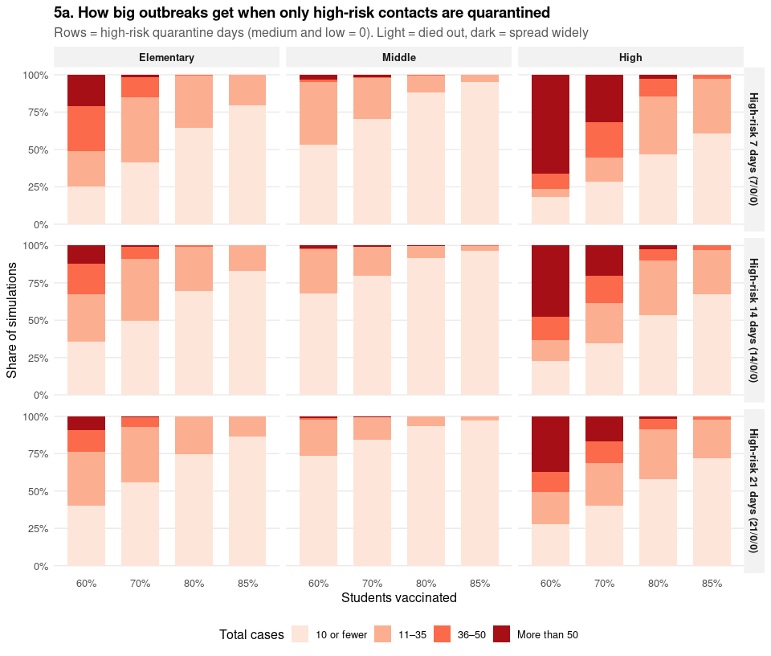
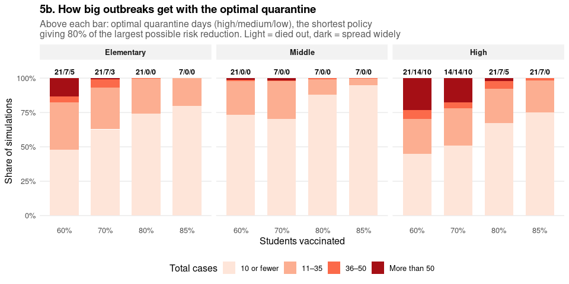
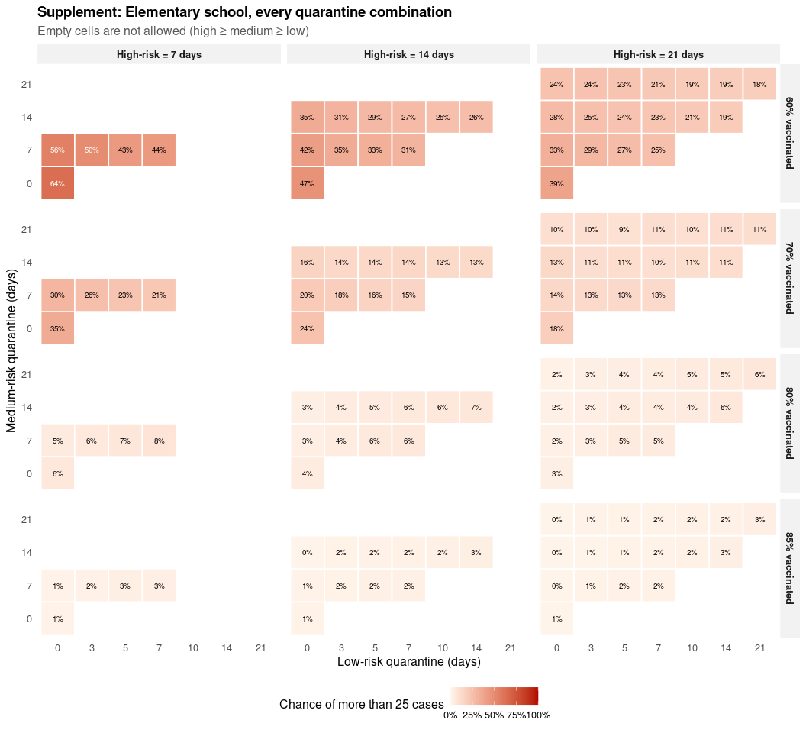
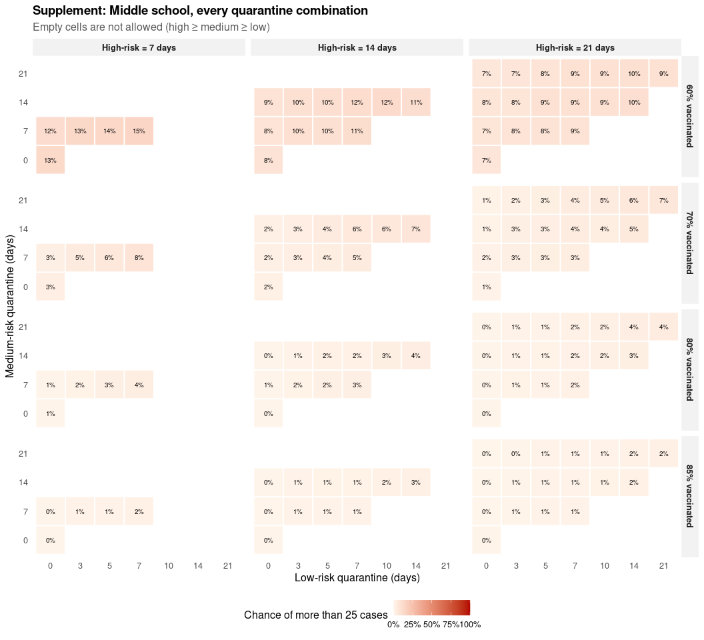
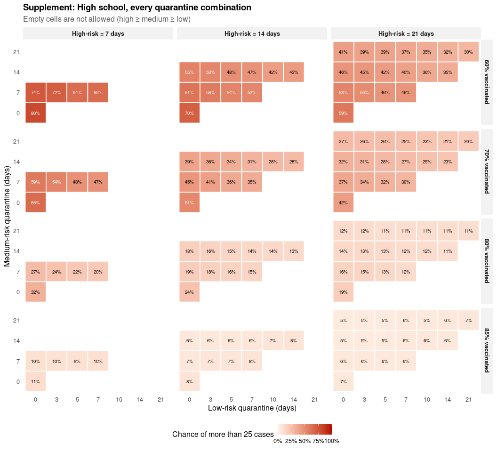

# 3. Which quarantine policy keeps outbreaks small?

- [Simulations](#simulations)
- [1. The problem](#the-problem)
- [2. What drives outbreak risk?](#what-drives-outbreak-risk)
- [3. Which quarantine combinations keep risk
  low?](#which-quarantine-combinations-keep-risk-low)
- [4. How many low-risk quarantine days are worth
  it?](#how-many-low-risk-quarantine-days-are-worth-it)
- [5. How big do outbreaks get?](#how-big-do-outbreaks-get)
- [Supplement: every quarantine combination, per
  school](#supplement-every-quarantine-combination-per-school)
- [Conclusions](#conclusions)

This is the main analysis. Every combination of school, vaccination
coverage and **high / medium / low-risk quarantine days** (with high ≥
medium ≥ low) is simulated once, and all figures are computed from that
single set of runs.

| Figure | Question                                                                        |
|:-------|:--------------------------------------------------------------------------------|
| 1      | How risky is each school with minimal quarantine?                               |
| 2      | What happens to outbreak risk when one factor changes, and is the change clear? |
| 3      | Which quarantine combinations keep risk low?                                    |
| 4      | Given high- and medium-risk days, how many low-risk days are worth it?          |
| 5      | How big do outbreaks get, with high-risk-only and with optimal quarantine?      |
| 6      | How does risk change with low-risk days, across thresholds?                     |

Plain-language conclusions, computed from the results, are at the end
and are also written to `results/conclusions.txt`.

<div>

> **Note**
>
> Model code lives in `measles_model.R`. Simulations are cached in
> `results/`, and PNG copies of every figure are saved to `figures/`.

</div>

## Simulations

136 quarantine/vaccination settings per school × 3 schools × 4,000
simulations = 1,632,000 runs.

<div>

> **What “outbreak risk” means in this report**
>
> Each simulation starts with one infected student. An **outbreak** is a
> simulation that ends with **more than 25 total cases**. The **outbreak
> risk** of a setting is the share of its 4,000 simulations that ended
> this way, i.e. P(final outbreak size \> 25). Figures 1 to 5 and the
> conclusions use this definition; Figure 6 repeats it for several other
> thresholds.

</div>

## 1. The problem

With minimal quarantine (only high-risk contacts quarantined), how
likely is an outbreak?



## 2. What drives outbreak risk?

Each panel changes **one** factor while the others stay fixed, and shows
the outbreak risk before (grey dot) and after (arrow). The fixed values
are named in each panel’s title. Vaccination is compared at one fixed
quarantine policy; each quarantine tier is compared at the lowest and
highest vaccination level.

Each risk comes from a finite number of simulations, so two settings can
differ a little just by chance. Arrows are therefore coloured by whether
the change is **clear**: blue if the risk is clearly lower, red if
clearly higher, and grey if the 95% confidence interval of the change
includes 0 (the change can’t be told apart from simulation noise). The
table below the figure gives the numbers.



**Small benefits, with 95% confidence intervals.** Large changes are
clear from the figure, so this table only lists the comparisons where
the **benefit is under 5 percentage points**, where simulation noise
matters most. Benefit = risk before − risk after, in percentage points:
positive = lower risk, negative = higher risk. *Clearly lower / higher*
means the whole interval is above / below 0; *No clear change* means the
interval includes 0. Intervals reflect simulation noise only, not
uncertainty in the model’s assumptions.

*Increasing vaccination: 60% → 85% (quarantine 14/7/0 days)*

All comparisons in this panel have a benefit of 5 points or more.

*Increasing high-risk quarantine: 14 → 21 days (medium 14, low 0 days)*

| Setting                     | Risk before | Risk after | Benefit, points (95% CI) | Verdict         |
|:----------------------------|------------:|-----------:|-------------------------:|:----------------|
| Elementary · 85% vaccinated |        0.4% |       0.4% |      +0.0 (-0.3 to +0.3) | No clear change |
| Middle · 60% vaccinated     |        8.6% |       7.6% |      +1.0 (-0.2 to +2.2) | No clear change |
| Middle · 85% vaccinated     |        0.3% |       0.2% |      +0.1 (-0.1 to +0.4) | No clear change |
| High · 85% vaccinated       |        6.2% |       5.2% |      +0.9 (-0.1 to +1.9) | No clear change |

*Increasing medium-risk quarantine: 0 → 14 days (high 14, low 0 days)*

| Setting                     | Risk before | Risk after | Benefit, points (95% CI) | Verdict         |
|:----------------------------|------------:|-----------:|-------------------------:|:----------------|
| Elementary · 85% vaccinated |        1.0% |       0.4% |      +0.6 (+0.2 to +1.0) | Clearly lower   |
| Middle · 60% vaccinated     |        8.3% |       8.6% |      -0.4 (-1.6 to +0.8) | No clear change |
| Middle · 85% vaccinated     |        0.3% |       0.3% |      -0.0 (-0.3 to +0.2) | No clear change |
| High · 85% vaccinated       |        8.0% |       6.2% |      +1.9 (+0.7 to +3.0) | Clearly lower   |

*Increasing low-risk quarantine: 0 → 7 days (high 14, medium 7 days)*

| Setting                     | Risk before | Risk after | Benefit, points (95% CI) | Verdict         |
|:----------------------------|------------:|-----------:|-------------------------:|:----------------|
| Elementary · 85% vaccinated |        0.8% |       2.2% |      -1.5 (-2.0 to -1.0) | Clearly higher  |
| Middle · 60% vaccinated     |        8.1% |      10.9% |      -2.8 (-4.1 to -1.5) | Clearly higher  |
| Middle · 85% vaccinated     |        0.1% |       1.3% |      -1.2 (-1.6 to -0.8) | Clearly higher  |
| High · 85% vaccinated       |        6.8% |       7.9% |      -1.1 (-2.2 to +0.1) | No clear change |

## 3. Which quarantine combinations keep risk low?

Every quarantine combination, coloured by its outbreak risk on a
continuous scale: **light = low risk, dark = high risk**. The number in
each square is its risk. Squares with a **black outline** have a risk of
10% or less. Columns are medium / low-risk days, grouped by high-risk
days; low-risk days are shown in weekly steps to keep the figure
readable.



## 4. How many low-risk quarantine days are worth it?

For each fixed high/medium policy: the fewest low-risk days that give
80% of the benefit low-risk quarantine can provide. Each cell shows
those days and the risk without → with them.



### How sure is “not worth it”?

A cell is *not worth it* when the largest benefit low-risk quarantine
gives is under 2 percentage points. The tables below list only those
cells, school by school. For each, the risk with 0 low-risk days is
compared with the risk at the number of low-risk days that gave the
largest benefit (or the longest allowed, if none helped), with a **95%
confidence interval** for the benefit (Newcombe method for a difference
of two proportions; every setting has its own seed, so the two risks are
independent).

- **Benefit** = risk with 0 low-risk days − risk with those days, in
  percentage points (positive = lower risk).
- **Clearly under 2 points?** *Yes* if the whole interval is below 2
  points, so the true benefit is small. *No* if the interval reaches 2
  points or more: the benefit is probably small, but these simulations
  can’t rule out a benefit of that size.

The intervals show simulation uncertainty only, not uncertainty in the
model’s assumptions.

<div class="panel-tabset">

#### Elementary

| Vaccinated | High / medium days | Low-risk days compared | Risk, 0 days | Risk, with days | Benefit, points (95% CI) | Clearly under 2 points? |
|:-----------|:-------------------|:-----------------------|-------------:|----------------:|-------------------------:|:-----------------------:|
| 70%        | 21 / 21            | 0 vs 5                 |        10.4% |            9.0% |      +1.4 (+0.2 to +2.8) |           No            |
| 70%        | 21 / 7             | 0 vs 3                 |        14.3% |           12.7% |      +1.6 (+0.1 to +3.1) |           No            |
| 80%        | 21 / 21            | 0 vs 21                |         1.9% |            6.5% |      -4.6 (-5.5 to -3.7) |           Yes           |
| 80%        | 21 / 14            | 0 vs 14                |         2.3% |            6.0% |      -3.7 (-4.6 to -2.9) |           Yes           |
| 80%        | 21 / 7             | 0 vs 7                 |         2.4% |            4.8% |      -2.4 (-3.2 to -1.6) |           Yes           |
| 80%        | 14 / 14            | 0 vs 14                |         2.8% |            6.6% |      -3.9 (-4.8 to -2.9) |           Yes           |
| 80%        | 14 / 7             | 0 vs 7                 |         3.2% |            5.9% |      -2.7 (-3.7 to -1.8) |           Yes           |
| 80%        | 7 / 7              | 0 vs 7                 |         4.8% |            8.0% |      -3.2 (-4.3 to -2.1) |           Yes           |
| 85%        | 21 / 21            | 0 vs 21                |         0.4% |            3.1% |      -2.7 (-3.3 to -2.1) |           Yes           |
| 85%        | 21 / 14            | 0 vs 14                |         0.4% |            2.8% |      -2.4 (-3.0 to -1.9) |           Yes           |
| 85%        | 21 / 7             | 0 vs 7                 |         0.4% |            1.8% |      -1.4 (-1.9 to -1.0) |           Yes           |
| 85%        | 14 / 14            | 0 vs 14                |         0.4% |            3.0% |      -2.5 (-3.1 to -2.0) |           Yes           |
| 85%        | 14 / 7             | 0 vs 7                 |         0.8% |            2.2% |      -1.5 (-2.0 to -1.0) |           Yes           |
| 85%        | 7 / 7              | 0 vs 7                 |         0.8% |            3.2% |      -2.3 (-3.0 to -1.7) |           Yes           |

#### Middle

| Vaccinated | High / medium days | Low-risk days compared | Risk, 0 days | Risk, with days | Benefit, points (95% CI) | Clearly under 2 points? |
|:-----------|:-------------------|:-----------------------|-------------:|----------------:|-------------------------:|:-----------------------:|
| 60%        | 21 / 21            | 0 vs 21                |         6.6% |            9.4% |      -2.7 (-3.9 to -1.5) |           Yes           |
| 60%        | 21 / 14            | 0 vs 3                 |         7.6% |            7.6% |      +0.1 (-1.1 to +1.2) |           Yes           |
| 60%        | 21 / 7             | 0 vs 7                 |         7.4% |            8.6% |      -1.2 (-2.4 to -0.1) |           Yes           |
| 60%        | 14 / 14            | 0 vs 14                |         8.6% |           10.7% |      -2.1 (-3.3 to -0.8) |           Yes           |
| 60%        | 14 / 7             | 0 vs 7                 |         8.1% |           10.9% |      -2.8 (-4.1 to -1.5) |           Yes           |
| 60%        | 7 / 7              | 0 vs 7                 |        11.6% |           14.6% |      -2.9 (-4.4 to -1.4) |           Yes           |
| 70%        | 21 / 21            | 0 vs 21                |         1.4% |            6.6% |      -5.2 (-6.1 to -4.4) |           Yes           |
| 70%        | 21 / 14            | 0 vs 14                |         1.5% |            5.4% |      -3.9 (-4.7 to -3.1) |           Yes           |
| 70%        | 21 / 7             | 0 vs 7                 |         1.6% |            3.4% |      -1.7 (-2.4 to -1.0) |           Yes           |
| 70%        | 14 / 14            | 0 vs 14                |         2.2% |            7.0% |      -4.8 (-5.7 to -3.9) |           Yes           |
| 70%        | 14 / 7             | 0 vs 7                 |         2.2% |            4.7% |      -2.4 (-3.2 to -1.6) |           Yes           |
| 70%        | 7 / 7              | 0 vs 7                 |         2.7% |            7.9% |      -5.2 (-6.2 to -4.2) |           Yes           |
| 80%        | 21 / 21            | 0 vs 21                |         0.4% |            4.2% |      -3.9 (-4.6 to -3.2) |           Yes           |
| 80%        | 21 / 14            | 0 vs 14                |         0.4% |            3.0% |      -2.6 (-3.2 to -2.1) |           Yes           |
| 80%        | 21 / 7             | 0 vs 7                 |         0.4% |            1.9% |      -1.5 (-2.0 to -1.0) |           Yes           |
| 80%        | 14 / 14            | 0 vs 14                |         0.3% |            3.6% |      -3.3 (-3.9 to -2.7) |           Yes           |
| 80%        | 14 / 7             | 0 vs 7                 |         0.6% |            2.8% |      -2.1 (-2.7 to -1.6) |           Yes           |
| 80%        | 7 / 7              | 0 vs 7                 |         0.6% |            3.8% |      -3.2 (-3.8 to -2.5) |           Yes           |
| 85%        | 21 / 21            | 0 vs 21                |         0.2% |            2.4% |      -2.2 (-2.8 to -1.8) |           Yes           |
| 85%        | 21 / 14            | 0 vs 14                |         0.2% |            1.9% |      -1.7 (-2.2 to -1.3) |           Yes           |
| 85%        | 21 / 7             | 0 vs 7                 |         0.2% |            1.2% |      -1.1 (-1.5 to -0.7) |           Yes           |
| 85%        | 14 / 14            | 0 vs 14                |         0.3% |            2.5% |      -2.2 (-2.8 to -1.8) |           Yes           |
| 85%        | 14 / 7             | 0 vs 7                 |         0.1% |            1.3% |      -1.2 (-1.6 to -0.8) |           Yes           |
| 85%        | 7 / 7              | 0 vs 7                 |         0.4% |            2.0% |      -1.6 (-2.1 to -1.2) |           Yes           |

#### High

| Vaccinated | High / medium days | Low-risk days compared | Risk, 0 days | Risk, with days | Benefit, points (95% CI) | Clearly under 2 points? |
|:-----------|:-------------------|:-----------------------|-------------:|----------------:|-------------------------:|:-----------------------:|
| 80%        | 21 / 21            | 0 vs 5                 |        12.0% |           10.7% |      +1.3 (-0.1 to +2.7) |           No            |
| 85%        | 21 / 21            | 0 vs 21                |         5.1% |            6.7% |      -1.6 (-2.6 to -0.6) |           Yes           |
| 85%        | 21 / 14            | 0 vs 3                 |         5.2% |            5.0% |      +0.2 (-0.7 to +1.2) |           Yes           |
| 85%        | 21 / 7             | 0 vs 7                 |         6.0% |            6.4% |      -0.4 (-1.5 to +0.7) |           Yes           |
| 85%        | 14 / 14            | 0 vs 14                |         6.2% |            7.9% |      -1.7 (-2.8 to -0.6) |           Yes           |
| 85%        | 14 / 7             | 0 vs 7                 |         6.8% |            7.9% |      -1.1 (-2.2 to +0.1) |           Yes           |
| 85%        | 7 / 7              | 0 vs 5                 |        10.0% |            9.1% |      +1.0 (-0.3 to +2.3) |           No            |

</div>

## 5. How big do outbreaks get?

<div class="panel-tabset">

### 5a. Only high-risk contacts quarantined



### 5b. Optimal quarantine

**How the optimal policy is computed.** For one school and one
vaccination level, let $P(h, m, l)$ be the outbreak risk with $h$ high-,
$m$ medium- and $l$ low-risk quarantine days: the share of simulations
with more than 25 cases. Only policies with $h \ge m \ge l$ are
considered.

1.  **Risk with minimal quarantine:** $P_0 = P(7, 0, 0)$.
2.  **Lowest risk any tested policy reaches:**
    $P_{\min} = \min_{h, m, l} P(h, m, l)$.
3.  **Largest possible reduction:** $G = P_0 - P_{\min}$.
4.  **If quarantine barely helps** ($G <$ 2%), the optimal policy is
    minimal quarantine, 7 / 0 / 0.
5.  **Otherwise, a policy is good enough** if it gets at least 80% of
    the largest reduction: $$P_0 - P(h, m, l) \ge 0.8 \times G$$
6.  **The optimal policy** is the good-enough policy with the fewest
    total quarantine days $h + m + l$. If several tie, the one with the
    lowest risk is chosen.

*Example:* Elementary school, 60% vaccinated. $P_0$ = 64.0% and
$P_{\min}$ = 18.2%, so $G$ = 45.7 percentage points. A good-enough
policy must bring the risk down to 27.4% or lower (64.0% − 0.8 × 45.7
points). The shortest such policy is **21/7/5** (33 days in total), with
a risk of 27.2%.



</div>

## Supplement: every quarantine combination, per school

<div class="panel-tabset">

### Elementary

### Middle



### High



</div>

## Conclusions

``` text
CONCLUSIONS  (outbreak = more than 25 cases)

1. THE PROBLEM
   With minimal quarantine, High school is the riskiest (average 47%)
   and Middle school the least risky (average 4%).

2. WHAT MATTERS MOST
   Increasing vaccination: 60% -> 85%  (quarantine 14/7/0 days):
     Elementary: risk 42% -> 1% (change -40.9 points, 95% CI -42.5 to -39.3: clearly lower)
     Middle: risk 8% -> 0% (change -8.0 points, 95% CI -8.8 to -7.1: clearly lower)
     High: risk 61% -> 7% (change -54.6 points, 95% CI -56.3 to -52.9: clearly lower)
   Increasing high-risk quarantine: 14 -> 21 days  (medium 14, low 0 days):
     Elementary - 60% vaccinated: risk 35% -> 28% (change -7.6 points, 95% CI -9.6 to -5.5: clearly lower)
     Elementary - 85% vaccinated: risk 0% -> 0% (change -0.0 points, 95% CI -0.3 to +0.3: no clear change)
     Middle - 60% vaccinated: risk 9% -> 8% (change -1.0 points, 95% CI -2.2 to +0.2: no clear change)
     Middle - 85% vaccinated: risk 0% -> 0% (change -0.1 points, 95% CI -0.4 to +0.1: no clear change)
     High - 60% vaccinated: risk 55% -> 46% (change -8.7 points, 95% CI -10.9 to -6.5: clearly lower)
     High - 85% vaccinated: risk 6% -> 5% (change -0.9 points, 95% CI -1.9 to +0.1: no clear change)
   Increasing medium-risk quarantine: 0 -> 14 days  (high 14, low 0 days):
     Elementary - 60% vaccinated: risk 47% -> 35% (change -11.9 points, 95% CI -14.0 to -9.8: clearly lower)
     Elementary - 85% vaccinated: risk 1% -> 0% (change -0.6 points, 95% CI -1.0 to -0.2: clearly lower)
     Middle - 60% vaccinated: risk 8% -> 9% (change +0.4 points, 95% CI -0.8 to +1.6: no clear change)
     Middle - 85% vaccinated: risk 0% -> 0% (change +0.0 points, 95% CI -0.2 to +0.3: no clear change)
     High - 60% vaccinated: risk 70% -> 55% (change -15.6 points, 95% CI -17.7 to -13.5: clearly lower)
     High - 85% vaccinated: risk 8% -> 6% (change -1.9 points, 95% CI -3.0 to -0.7: clearly lower)
   Increasing low-risk quarantine: 0 -> 7 days  (high 14, medium 7 days):
     Elementary - 60% vaccinated: risk 42% -> 31% (change -10.9 points, 95% CI -13.0 to -8.9: clearly lower)
     Elementary - 85% vaccinated: risk 1% -> 2% (change +1.5 points, 95% CI +1.0 to +2.0: clearly higher)
     Middle - 60% vaccinated: risk 8% -> 11% (change +2.8 points, 95% CI +1.5 to +4.1: clearly higher)
     Middle - 85% vaccinated: risk 0% -> 1% (change +1.2 points, 95% CI +0.8 to +1.6: clearly higher)
     High - 60% vaccinated: risk 61% -> 53% (change -8.9 points, 95% CI -11.0 to -6.7: clearly lower)
     High - 85% vaccinated: risk 7% -> 8% (change +1.1 points, 95% CI -0.1 to +2.2: no clear change)

3. WHAT A SCHOOL SHOULD DO
   To keep risk under 10%:
     Elementary: achievable from 70% vaccination; minimal quarantine is enough from 80% vaccination.
     Middle: achievable from 60% vaccination; minimal quarantine is enough from 70% vaccination.
     High: achievable from 85% vaccination; minimal quarantine is enough at no tested level.
   To keep risk under 20%:
     Elementary: achievable from 60% vaccination; minimal quarantine is enough from 80% vaccination.
     Middle: achievable from 60% vaccination; minimal quarantine is enough from 60% vaccination.
     High: achievable from 70% vaccination; minimal quarantine is enough from 85% vaccination.
   To keep risk under 30%:
     Elementary: achievable from 60% vaccination; minimal quarantine is enough from 80% vaccination.
     Middle: achievable from 60% vaccination; minimal quarantine is enough from 60% vaccination.
     High: achievable from 60% vaccination; minimal quarantine is enough from 85% vaccination.

4. LOW-RISK QUARANTINE
   Elementary: the best low-risk quarantine is usually about 0 days.
     It is not worth it (risk drops less than 2%) in 58% of high/medium settings.
     On average, risk goes 14% -> 11% with the best number of days,
     and only to 11% even with the longest low-risk quarantine.
   Middle: the best low-risk quarantine is usually about 0 days.
     It is not worth it (risk drops less than 2%) in 100% of high/medium settings.
     On average, risk goes 3% -> 3% with the best number of days,
     and only to 3% even with the longest low-risk quarantine.
   High: the best low-risk quarantine is usually about 5 days.
     It is not worth it (risk drops less than 2%) in 29% of high/medium settings.
     On average, risk goes 30% -> 24% with the best number of days,
     and only to 24% even with the longest low-risk quarantine.

5. SIZE OF OUTBREAKS
   Elementary, minimal quarantine: chance of more than 50 cases falls from 21% at 60% to 0% at 85% vaccination.
     Optimal quarantine (high/medium/low days): 21/7/5 at 60%; 21/7/3 at 70%; 21/0/0 at 80%; 7/0/0 at 85%.
     With it, the chance of more than 50 cases is 13% at 60% and 0% at 85% vaccination.
   Middle, minimal quarantine: chance of more than 50 cases falls from 3% at 60% to 0% at 85% vaccination.
     Optimal quarantine (high/medium/low days): 21/0/0 at 60%; 7/0/0 at 70%; 7/0/0 at 80%; 7/0/0 at 85%.
     With it, the chance of more than 50 cases is 1% at 60% and 0% at 85% vaccination.
   High, minimal quarantine: chance of more than 50 cases falls from 66% at 60% to 0% at 85% vaccination.
     Optimal quarantine (high/medium/low days): 21/14/10 at 60%; 14/14/10 at 70%; 21/7/5 at 80%; 21/7/0 at 85%.
     With it, the chance of more than 50 cases is 23% at 60% and 0% at 85% vaccination.
```
