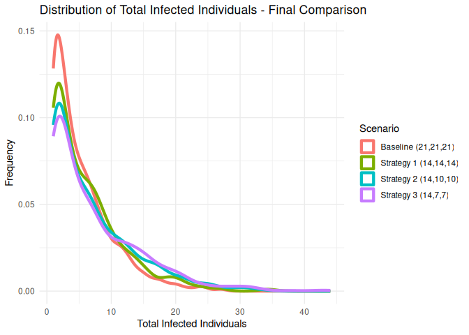

# Measles Tiered Quarantine Simulation
George G. Vega Yon, Ph.D.
2025-10-23

- [Setup](#setup)
- [Scenarios](#scenarios)
  - [Scenario: No vaccination, only one risk level
    quarantined](#scenario-no-vaccination-only-one-risk-level-quarantined)
  - [Scenario: 50% vaccination, tiered
    quarantine](#scenario-50-vaccination-tiered-quarantine)
  - [Scenario: 80% vaccination, tiered
    quarantine](#scenario-80-vaccination-tiered-quarantine)
  - [Scenario: 90% vaccination, tiered
    quarantine](#scenario-90-vaccination-tiered-quarantine)
  - [Scenario: Lower quarantine duration (14
    days)](#scenario-lower-quarantine-duration-14-days)
- [Overall comparison](#overall-comparison)
- [Discussion](#discussion)
- [Version](#version)

> [!CAUTION]
> This project is a work in progress. Use it at your own
> risk. **This model simulates a single school, so community
> transmission is not included**.

> [!IMPORTANT]
> The model makes several assumptions that may not hold
> in real-world scenarios. One important assumption is that interactions
> between agents are based solely on class assignments, and not based on
> friendship networks or other social structures. This assumption
> reflects strongly in the effect of mid-risk quarantine (see below for
> more details).

## Setup

This document illustrates an experiment using the `epiworldR` package to
simulate measles transmission under a tiered quarantine strategy. In the
tier quarantine system, agents have different quarantine durations as a
function of their risk level, which are defined as follows:

- **High risk**: Agents in the same classroom as an infected individual.
- **Medium risk**: Agents who were not in the same classroom as the
  infected individual, but were in direct contact with them.
- **Low risk**: Agents who were not in the same classroom or direct
  contact with the infected individual.

Quarantine only applies to unvaccinated agents. The simulation settings
are as follows:

- Individual school with 600 students distributed across 20 classes (30
  students per class).
- The contact rate is given by our previous estimates for within-class
  and between-class interactions: 83% of contacts occur within the same
  class, while 17% occur between different classes.
- The basic reproduction number (R0) is set to 15, reflecting the high
  transmissibility of measles.
- Contact tracing is assumed to be 100% effective, as agents’
  willingness to isolate and quarantine.

The following code block sets up some of the simulation parameters,
including sourcing the simulator function in the file
[`simulator.R`](./simulator.R):

``` r
library(epiworldR)
```

    Thank you for using epiworldR! Please consider citing it in your work.
    You can find the citation information by running
      citation("epiworldR")

``` r
library(data.table)
library(ggplot2)
source("simulator.R")

# Simulation parameters
n_sims    <- 1000
n_agents  <- 600
n_classes <- 20
n_agents_per_class <- n_agents / n_classes
n_days    <- 100
n_threads <- 10

# Makesure it's even
stopifnot(n_agents_per_class %% 1 == 0)
```

The particular disease parameters for measles, including the mixing
matrix that will be used for the simulation, are defined as follows:

``` r
# Disease parameters
R0 <- 15
contact_rate <- 20
incubation <- 12
prodromal   <- 4
rash        <- 3

# Creating the mixing matrix
within_class_contact_rate <- 0.83
between_class_contact_rate <- 1 - within_class_contact_rate

contact_matrix <- matrix(
  between_class_contact_rate / (n_classes - 1),
  nrow = n_classes,
  ncol = n_classes
)
diag(contact_matrix) <- within_class_contact_rate

# Calibrating infection probability
p_infect <- R0 / (contact_rate) * (1/prodromal)
```

We will test the model using the following scenarios:

- 50%, 80%, and 95% vaccination coverage.
- Quarantine days set to 0, 7, 14, and 21 days.

## Scenarios

### Scenario: No vaccination, only one risk level quarantined

``` r
ans_none        <- simulator(duration = c(0L, 0L, 0L), vaccinated = 0.0)
ans_only_high   <- simulator(duration = c(21L, 0L, 0L), vaccinated = 0.0)
ans_only_medium <- simulator(duration = c(0L, 21L, 0L), vaccinated = 0.0)
ans_only_low    <- simulator(duration = c(0L, 0L, 21L), vaccinated = 0.0)

# Tabulating the results
tabulator(
  list(
    "No Quarantine" = ans_none,
    "Only High Risk Quarantine" = ans_only_high,
    "Only Medium Risk Quarantine" = ans_only_medium,
    "Only Low Risk Quarantine" = ans_only_low
  )
)
```

| Scenario                    | Outbreak size % (mean) | 95% CI           |
|:----------------------------|:-----------------------|:-----------------|
| No Quarantine               | 86.44                  | ( 28.99, 100.00) |
| Only High Risk Quarantine   | 68.71                  | ( 0.66, 100.00)  |
| Only Medium Risk Quarantine | 84.38                  | ( 25.50, 100.00) |
| Only Low Risk Quarantine    | 55.08                  | ( 1.66, 100.00)  |

### Scenario: 50% vaccination, tiered quarantine

For this scenario, we simulate with 50% vaccination coverage and compare
the following tiered quarantine strategies:

- Baseline: 21 days for all risk levels.
- Strategy 1: 21 days for high risk, 14 days for medium and low risk.
- Strategy 2: 21 days for high risk, 7 days for medium and low risk.
- Strategy 3: 21 days for high risk, no quarantine for medium and low
  risk.

``` r
ans_50_baseline <- simulator(duration = c(21L, 21L, 21L), vaccinated = 0.5)
ans_50_strategy1 <- simulator(duration = c(21L, 14L, 14L), vaccinated = 0.5)
ans_50_strategy2 <- simulator(duration = c(21L, 7L, 7L), vaccinated = 0.5)
ans_50_strategy3 <- simulator(duration = c(21L, 0L, 0L), vaccinated = 0.5)

# Tabulating the results
tabulator(
  list(
    "Baseline (21,21,21)" = ans_50_baseline,
    "Strategy 1 (21,14,14)" =  ans_50_strategy1,
    "Strategy 2 (21,7,7)" = ans_50_strategy2,
    "Strategy 3 (21,0,0)" = ans_50_strategy3
  )
)
```

| Scenario              | Outbreak size % (mean) | 95% CI         |
|:----------------------|:-----------------------|:---------------|
| Baseline (21,21,21)   | 16.95                  | ( 0.17, 50.50) |
| Strategy 1 (21,14,14) | 16.78                  | ( 0.17, 50.33) |
| Strategy 2 (21,7,7)   | 18.52                  | ( 0.17, 50.50) |
| Strategy 3 (21,0,0)   | 21.89                  | ( 0.17, 50.67) |

### Scenario: 80% vaccination, tiered quarantine

Similar to the previous scenario, we simulate with 80% vaccination
coverage and compare the same tiered quarantine strategies:

``` r
ans_80_baseline <- simulator(duration = c(21L, 21L, 21L), vaccinated = 0.8)
ans_80_strategy1 <- simulator(duration = c(21L, 14L, 14L), vaccinated = 0.8)
ans_80_strategy2 <- simulator(duration = c(21L, 7L, 7L), vaccinated = 0.8)
ans_80_strategy3 <- simulator(duration = c(21L, 0L, 0L), vaccinated = 0.8)

# Tabulating the results
tabulator(
  list(
    "Baseline (21,21,21)" = ans_80_baseline,
    "Strategy 1 (21,14,14)" =  ans_80_strategy1,
    "Strategy 2 (21,7,7)" = ans_80_strategy2,
    "Strategy 3 (21,0,0)" = ans_80_strategy3
  )
)
```

| Scenario              | Outbreak size % (mean) | 95% CI         |
|:----------------------|:-----------------------|:---------------|
| Baseline (21,21,21)   | 2.51                   | ( 0.17, 20.33) |
| Strategy 1 (21,14,14) | 2.40                   | ( 0.17, 20.33) |
| Strategy 2 (21,7,7)   | 2.87                   | ( 0.17, 20.50) |
| Strategy 3 (21,0,0)   | 2.44                   | ( 0.17, 20.33) |

### Scenario: 90% vaccination, tiered quarantine

Finally, we simulate with 90% vaccination coverage and compare the same
tiered quarantine strategies:

``` r
ans_90_baseline  <- simulator(duration = c(21L, 21L, 21L), vaccinated = 0.9)
ans_90_strategy1 <- simulator(duration = c(21L, 14L, 14L), vaccinated = 0.9)
ans_90_strategy2 <- simulator(duration = c(21L, 7L, 7L), vaccinated = 0.9)
ans_90_strategy3 <- simulator(duration = c(21L, 0L, 0L), vaccinated = 0.9)

# Tabulating the results
tabulator(
  list(
    "Baseline (21,21,21)"   = ans_90_baseline,
    "Strategy 1 (21,14,14)" = ans_90_strategy1,
    "Strategy 2 (21,7,7)"   = ans_90_strategy2,
    "Strategy 3 (21,0,0)"   = ans_90_strategy3
  )
)
```

| Scenario              | Outbreak size % (mean) | 95% CI        |
|:----------------------|:-----------------------|:--------------|
| Baseline (21,21,21)   | 0.70                   | ( 0.17, 2.17) |
| Strategy 1 (21,14,14) | 0.69                   | ( 0.17, 2.17) |
| Strategy 2 (21,7,7)   | 0.67                   | ( 0.17, 2.33) |
| Strategy 3 (21,0,0)   | 0.72                   | ( 0.17, 3.17) |

### Scenario: Lower quarantine duration (14 days)

For this scenario, we simulate with 80% vaccination coverage and a
maximum quarantine duration of 14 days, comparing the same tiered
quarantine strategies:

``` r
ans_80_21_baseline  <- simulator(duration = c(21L, 21L, 21L), vaccinated = 0.8)
ans_80_14_strategy1 <- simulator(duration = c(14L, 14L, 14L), vaccinated = 0.8)
ans_80_14_strategy2 <- simulator(duration = c(14L, 10L, 10L), vaccinated = 0.8)
ans_80_14_strategy3 <- simulator(duration = c(14L, 7L, 7L), vaccinated = 0.8)
ans_80_14_strategy4 <- simulator(duration = c(14L, 0L, 0L), vaccinated = 0.8)

# Tabulating the results
tabulator(
  list(
    "Baseline (21,21,21)"   = ans_80_21_baseline,
    "Strategy 1 (14,14,14)" =  ans_80_14_strategy1,
    "Strategy 2 (14,10,10)" = ans_80_14_strategy2,
    "Strategy 3 (14,7,7)"   = ans_80_14_strategy3,
    "Strategy 4 (14,0,0)"   = ans_80_14_strategy4
  )
)
```

| Scenario              | Outbreak size % (mean) | 95% CI         |
|:----------------------|:-----------------------|:---------------|
| Baseline (21,21,21)   | 2.51                   | ( 0.17, 20.33) |
| Strategy 1 (14,14,14) | 3.18                   | ( 0.17, 20.50) |
| Strategy 2 (14,10,10) | 3.09                   | ( 0.17, 20.33) |
| Strategy 3 (14,7,7)   | 3.38                   | ( 0.17, 20.50) |
| Strategy 4 (14,0,0)   | 3.06                   | ( 0.17, 20.50) |

## Overall comparison

Combining some of the results from different scenarios for a final
comparison of the tiered quarantine strategies with 80% vaccination
coverage:

``` r
tabulator(
  list(
    "Baseline (21,21,21)"   = ans_80_21_baseline,
    "Strategy 1 (14,14,14)" = ans_80_14_strategy1,
    "Strategy 2 (14,10,10)" = ans_80_14_strategy2,
    "Strategy 3 (14,7,7)"   = ans_80_14_strategy3
  )
)
```

| Scenario              | Outbreak size % (mean) | 95% CI         |
|:----------------------|:-----------------------|:---------------|
| Baseline (21,21,21)   | 2.51                   | ( 0.17, 20.33) |
| Strategy 1 (14,14,14) | 3.18                   | ( 0.17, 20.50) |
| Strategy 2 (14,10,10) | 3.09                   | ( 0.17, 20.33) |
| Strategy 3 (14,7,7)   | 3.38                   | ( 0.17, 20.50) |

``` r
# We can group the four into a single plot (histogram)
# for visual comparison
combined_results <- rbind(
  data.table(Scenario = "Baseline (21,21,21)", ans_80_21_baseline),
  data.table(Scenario = "Strategy 1 (14,14,14)", ans_80_14_strategy1),
  data.table(Scenario = "Strategy 2 (14,10,10)", ans_80_14_strategy2),
  data.table(Scenario = "Strategy 3 (14,7,7)", ans_80_14_strategy3)
)

combined_results[total_infected < 50] |>
  ggplot(aes(x = total_infected, color = Scenario)) +
    geom_density(linewidth=1.5) +
    labs(
      title = "Distribution of Total Infected Individuals - Final Comparison",
      x = "Total Infected Individuals",
      y = "Frequency"
    ) +
    theme_minimal()
```



# Discussion

The model presented here is a simplification of reality trying to
explore what a change in the quarantine strategy could mean for measles
outbreaks in school settings. The results suggest that quarantine
duration may be reduced without significantly increasing outbreak sizes
in the context of a relatively high vaccination coverage (80% or
higher). However, it is important to note that the model assumes perfect
compliance with quarantine measures and does not account for community
transmission outside the school setting.

The mid-risk quarantine strategy–which applies to agents who are not in
the same classroom but were in direct contact with an infected
individual–shows a marginal effect on outbreak sizes. Nonetheless, this
finding is contingent on the assumption that interactions happen
randomly based on class assignments, so, in real-world scenarios where
social networks and friendships play a significant role, the impact of
mid-risk quarantine could be more pronounced. Because of this, it would
be prudent to include mid-risk quarantine in the same category as
high-risk quarantine until more detailed models are developed.

# Version

This analysis was performed using `epiworldR` version 0.10.0.0, with R
version R version 4.5.1 (2025-06-13). You can get the latest version of
`epiworldR` from GitHub at <https://github.com/UofUEpiBio/epiworldR>.
