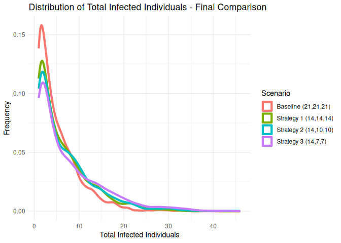

# Measles Tiered Quarantine Simulation
George G. Vega Yon, Ph.D.
2025-10-23

- [Description of the model](#description-of-the-model)
- [Setup](#setup)
- [Parameters & references](#parameters--references)
- [Scenarios](#scenarios)
  - [Scenario: No vaccination, only one risk level
    quarantined](#scenario-no-vaccination-only-one-risk-level-quarantined)
  - [Scenario: 50% vaccination, tiered
    quarantine](#scenario-50-vaccination-tiered-quarantine)
  - [Scenario: 80% vaccination, tiered
    quarantine](#scenario-80-vaccination-tiered-quarantine)
  - [Scenario: 90% vaccination, tiered
    quarantine](#scenario-90-vaccination-tiered-quarantine)
  - [Scenario: Lower quarantine duration (14
    days)](#scenario-lower-quarantine-duration-14-days)
- [Overall comparison](#overall-comparison)
- [Discussion](#discussion)
- [Version](#version)

[](https://github.com/EpiForeSITE/software)

> [!CAUTION]
> This project is a work in progress. Use it at your own risk. **This model simulates a single school, so community transmission is not included**.

> [!IMPORTANT]
> The model makes several assumptions that may not hold in real-world scenarios. One important assumption is that interactions between agents are based solely on class assignments, and not based on friendship networks or other social structures. This assumption reflects strongly in the effect of mid-risk quarantine (see below for more details).

## Description of the model

We are using the `ModelMeaslesMixingRiskQuarantine()` model from the
`epiworldR` package (version 0.10.0.0 or higher). This model uses a
mixing matrix to represent how agents’ interactions are distributed. In
this case, groups represent classrooms in a school, so kids will have
more interactions with kids in their own class than with kids from other
classes.

The model contains the full disease progression for measles, including
the incubation period, prodromal phase, and rash phase. The model
assumes that kids in the rash phase are isolated from their peers.
Nonetheless, the model is calibrated to reflect the measles
$\mathcal{R}_0$ of 15, so kids are infectious during the prodromal
period. Agents can also become hospitalized.

The quarantine process is triggered when an agent is detected during the
rash period. This could occur for more than one agent in the same step.
Quarantine process only applies to unvaccinated agents, and the duration
of quarantine depends on the risk level of the agent, as defined below.

## Setup

This document illustrates an experiment using the `epiworldR` package to
simulate measles transmission under a tiered quarantine strategy. In the
tier quarantine system, agents have different quarantine durations as a
function of their risk level, which are defined as follows:

- **High risk**: Agents in the same classroom as an infected individual.
- **Medium risk**: Agents who were not in the same classroom as the
  infected individual, but were in direct contact with them.
- **Low risk**: Agents who were not in the same classroom or direct
  contact with the infected individual.

Quarantine only applies to unvaccinated agents. The simulation settings
are as follows:

- Individual school with 600 students distributed across 20 classes (30
  students per class).
- The contact rate is given by our previous estimates for within-class
  and between-class interactions: 83% of contacts occur within the same
  class, while 17% occur between different classes.
- The basic reproduction number (R0) is set to 15, reflecting the high
  transmissibility of measles.
- Contact tracing is assumed to be 100% effective, as agents’
  willingness to isolate and quarantine.

The following code block sets up some of the simulation parameters,
including sourcing the simulator function in the file
[`simulator.R`](./simulator.R):

``` r
library(epiworldR)
```

    Thank you for using epiworldR! Please consider citing it in your work.
    You can find the citation information by running
      citation("epiworldR")

``` r
library(data.table)
library(ggplot2)
source("simulator.R")

# Simulation parameters
n_sims    <- 2000
n_agents  <- 600
n_classes <- 20
n_agents_per_class <- n_agents / n_classes
n_days    <- 100
n_threads <- 10

# Makesure it's even
stopifnot(n_agents_per_class %% 1 == 0)
```

The particular disease parameters for measles, including the mixing
matrix that will be used for the simulation, are defined as follows:

``` r
# Disease parameters
R0 <- 15
contact_rate <- 20
incubation <- 12
prodromal   <- 4
rash        <- 3

# Creating the mixing matrix
within_class_contact_rate <- 0.83
between_class_contact_rate <- 1 - within_class_contact_rate

contact_matrix <- matrix(
  between_class_contact_rate / (n_classes - 1),
  nrow = n_classes,
  ncol = n_classes
)
diag(contact_matrix) <- within_class_contact_rate

# Calibrating infection probability
p_infect <- R0 / (contact_rate) * (1/prodromal)
```

We will test the model using the following scenarios:

- 50%, 80%, and 95% vaccination coverage.
- Quarantine days set to 0, 7, 14, and 21 days.

To assess the risk effect between different quarantine strategies, we
report the probability of observing outbreaks of various sizes rather
than means and medians. Specifically, we calculate:

- **P(≥10)**: Probability that an outbreak reaches 10 or more infected
  individuals
- **P(≥20)**: Probability that an outbreak reaches 20 or more infected
  individuals
- **P(≥50)**: Probability that an outbreak reaches 50 or more infected
  individuals

This approach provides a clearer picture of the distribution’s tail
behavior and allows for better comparison of risk across different
strategies.

## Parameters & references

The table below lists every parameter of `ModelMeaslesMixingRiskQuarantine()` used in this analysis, including the ones left at their default value (marked "(default)"). **Value used** is what the simulations in this document ran with. The [`measles`](https://github.com/UofUEpiBio/measles) R package, which now hosts this model, keeps the canonical, cited parameter table: [`measles_parameters.csv`](https://github.com/UofUEpiBio/measles/blob/main/inst/extdata/measles_parameters.csv) (also available as `measles::measles_parameters()`; see the [parameters vignette](https://github.com/UofUEpiBio/measles/blob/main/vignettes/parameters.qmd)). Sources follow that table unless stated otherwise.

The results in this document were produced with `epiworldR` 0.10.0.0, where the model still lived; parameters not passed explicitly took that version's defaults. The contact-tracing window argument was then called `contact_tracing_days_prior` (now `contact_tracing_days_window`). `epiworldR` 0.10.0.0 also had a `contact_rate` argument that the `measles` package removed; there, the contact matrix holds the expected number of contacts instead.

| Parameter | Value used | Source |
|---|---|---|
| R0 (target) | 15 | Guerra et al. 2017, *Lancet Infect Dis* 17(12):e420–e428, [doi:10.1016/S1473-3099(17)30307-9](https://doi.org/10.1016/S1473-3099(17)30307-9). Midpoint of the 12–18 range. Not a model argument: used to calibrate the transmission probability (see below). |
| Contact rate (`contact_rate`) | 20 contacts/day | Team assumption; no source is recorded for 20 contacts/day. Not passed to the model explicitly: the `epiworldR` 0.10.0.0 default formula `15 / transmission_rate / prodromal_period` gives 15 / 0.1875 / 4 = 20, the same value used in the calibration. |
| Transmission probability (`transmission_rate`) | 0.1875 | Derived: R0 / (contact rate × prodromal period) = 15 / (20 × 4). The contact rate is fixed at 20 and the transmission probability is calibrated to R0 = 15. |
| Contact matrix (`contact_matrix`) | 20 × 20 classes; 0.83 within class, 0.17 / 19 to each other class | Team estimate: "our previous estimates for within-class and between-class interactions"; no citation is recorded for the 83% / 17% split. Row-stochastic mixing proportions (`epiworldR` 0.10.0.0 semantics), multiplied by the contact rate of 20; in the `measles` package the equivalent input is 20 × this matrix (expected contacts per day). |
| Population size (`n`) | 600 (20 classes of 30) | Scenario-specific input: a single school. |
| Prevalence (`prevalence`) | 1 / 600 (one index case) | Scenario-specific input. |
| Vaccination coverage (`prop_vaccinated`) | 0, 0.5, 0.8, 0.9 (by scenario) | Scenario-specific input (scenarios, not estimates). |
| Vaccine efficacy (`vax_efficacy`) | 0.99 (`epiworldR` 0.10.0.0 default) | Liu et al. 2015, *BMC Public Health* 15:447, [doi:10.1186/s12889-015-1766-6](https://doi.org/10.1186/s12889-015-1766-6). Not passed explicitly, so the results used the `epiworldR` 0.10.0.0 default. |
| Incubation period (`incubation_period`) | 12 days (default) | [Utah DHHS Measles Disease Plan](https://epi.utah.gov/wp-content/uploads/Measles-disease-plan.pdf): exposure to prodrome averages 8–12 days. Defined as `incubation <- 12` in the setup code but not passed. |
| Prodromal period (`prodromal_period`) | 4 days (default) | [Utah DHHS Measles Disease Plan](https://epi.utah.gov/wp-content/uploads/Measles-disease-plan.pdf): prodrome 2–4 days; contagious 4 days before rash onset. Not passed; the same value (4) is used in the transmission calibration. |
| Rash period (`rash_period`) | 3 days (default) | [Utah DHHS Measles Disease Plan](https://epi.utah.gov/wp-content/uploads/Measles-disease-plan.pdf): contagious to 4 days after rash onset; infectivity minimal after day 2 of rash. Defined as `rash <- 3` but not passed. Only the infectious part of the rash is modeled. |
| Hospitalization rate (`hospitalization_rate`) | 0.2 per day (default; a daily rate, not a probability: p = h / (h + 1/rash) = 0.2 / (0.2 + 1/3) ≈ 0.375) | Conservative value agreed with Utah DHHS; recent analyses use 10% per Jones et al. 2026, *NEJM Evid* 5(8), [doi:10.1056/EVIDpha2600141](https://doi.org/10.1056/EVIDpha2600141). |
| Hospitalization period (`hospitalization_period`) | 7 days (default) | Assumption. Observed stays are shorter (Utah mean 2.1 nights, Jones et al. 2026). |
| Days undetected (`days_undetected`) | 2 days (default) | Assumption: about 2 days from active case to public-health notification. |
| Isolation period (`isolation_period`) | 4 days (default) | [Utah DHHS Measles Disease Plan](https://epi.utah.gov/wp-content/uploads/Measles-disease-plan.pdf): isolate until 4 days after rash onset. |
| Isolation willingness (`isolation_willingness`) | 1 (default) | Assumption (field experience): perfect compliance, as stated in the Setup. |
| Quarantine willingness (`quarantine_willingness`) | 1 (default) | Assumption (field experience): perfect compliance, as stated in the Setup. |
| Contact-tracing success rate (`contact_tracing_success_rate`) | 1 (default) | Assumption (field experience): 100% effective contact tracing, as stated in the Setup. |
| Contact-tracing window (`contact_tracing_days_prior` in `epiworldR` 0.10.0.0; `contact_tracing_days_window` in `measles`) | 7 days | Set explicitly to 7 in `simulator.R`. The rationale for 7 is not recorded. |
| Detection rate in quarantine (`detection_rate_quarantine`) | 0 | Assumption. Set explicitly to 0 in `simulator.R`: prodromal agents in quarantine are never detected, so detection happens only through the rash. The rationale is not recorded. |
| Quarantine period, high risk (`quarantine_period_high`) | 21 days in most scenarios; 0 or 14 in some | Our own experiments and discussions with Utah DHHS (experimental; no published source). Set explicitly per scenario. The 21-day tier matches the Utah DHHS standard quarantine (21 days since last exposure). |
| Quarantine period, medium risk (`quarantine_period_medium`) | 0, 7, 10, 14 or 21 days (by scenario) | Our own experiments and discussions with Utah DHHS (experimental; no published source). Set explicitly per scenario; these lengths are what the experiment varies. |
| Quarantine period, low risk (`quarantine_period_low`) | 0, 7, 10, 14 or 21 days (by scenario) | Our own experiments and discussions with Utah DHHS (experimental; no published source). Set explicitly per scenario; these lengths are what the experiment varies. |

## Scenarios

### Scenario: No vaccination, only one risk level quarantined

``` r
ans_none        <- simulator(duration = c(0L, 0L, 0L), vaccinated = 0.0)
ans_only_high   <- simulator(duration = c(21L, 0L, 0L), vaccinated = 0.0)
ans_only_medium <- simulator(duration = c(0L, 21L, 0L), vaccinated = 0.0)
ans_only_low    <- simulator(duration = c(0L, 0L, 21L), vaccinated = 0.0)

# Tabulating the results
tabulator(
  list(
    "No Quarantine" = ans_none,
    "Only High Risk Quarantine" = ans_only_high,
    "Only Medium Risk Quarantine" = ans_only_medium,
    "Only Low Risk Quarantine" = ans_only_low
  )
)
```

| Scenario                    | P(≥10) | P(≥20) | P(≥50) |
|:----------------------------|:-------|:-------|:-------|
| No Quarantine               | 0.991  | 0.991  | 0.991  |
| Only High Risk Quarantine   | 0.928  | 0.919  | 0.910  |
| Only Medium Risk Quarantine | 0.987  | 0.987  | 0.987  |
| Only Low Risk Quarantine    | 0.977  | 0.960  | 0.632  |

Probability of outbreak sizes across different quarantine scenarios.

### Scenario: 50% vaccination, tiered quarantine

For this scenario, we simulate with 50% vaccination coverage and compare
the following tiered quarantine strategies:

- Baseline: 21 days for all risk levels.
- Strategy 1: 21 days for high risk, 14 days for medium and low risk.
- Strategy 2: 21 days for high risk, 7 days for medium and low risk.
- Strategy 3: 21 days for high risk, no quarantine for medium and low
  risk.

``` r
ans_50_baseline <- simulator(duration = c(21L, 21L, 21L), vaccinated = 0.5)
ans_50_strategy1 <- simulator(duration = c(21L, 14L, 14L), vaccinated = 0.5)
ans_50_strategy2 <- simulator(duration = c(21L, 7L, 7L), vaccinated = 0.5)
ans_50_strategy3 <- simulator(duration = c(21L, 0L, 0L), vaccinated = 0.5)

# Tabulating the results
tabulator(
  list(
    "Baseline (21,21,21)" = ans_50_baseline,
    "Strategy 1 (21,14,14)" =  ans_50_strategy1,
    "Strategy 2 (21,7,7)" = ans_50_strategy2,
    "Strategy 3 (21,0,0)" = ans_50_strategy3
  )
)
```

| Scenario              | P(≥10) | P(≥20) | P(≥50) |
|:----------------------|:-------|:-------|:-------|
| Baseline (21,21,21)   | 0.686  | 0.513  | 0.313  |
| Strategy 1 (21,14,14) | 0.705  | 0.506  | 0.311  |
| Strategy 2 (21,7,7)   | 0.746  | 0.633  | 0.425  |
| Strategy 3 (21,0,0)   | 0.800  | 0.751  | 0.674  |

Probability of outbreak sizes across different quarantine scenarios.

### Scenario: 80% vaccination, tiered quarantine

Similar to the previous scenario, we simulate with 80% vaccination
coverage and compare the same tiered quarantine strategies:

``` r
ans_80_baseline <- simulator(duration = c(21L, 21L, 21L), vaccinated = 0.8)
ans_80_strategy1 <- simulator(duration = c(21L, 14L, 14L), vaccinated = 0.8)
ans_80_strategy2 <- simulator(duration = c(21L, 7L, 7L), vaccinated = 0.8)
ans_80_strategy3 <- simulator(duration = c(21L, 0L, 0L), vaccinated = 0.8)

# Tabulating the results
tabulator(
  list(
    "Baseline (21,21,21)" = ans_80_baseline,
    "Strategy 1 (21,14,14)" =  ans_80_strategy1,
    "Strategy 2 (21,7,7)" = ans_80_strategy2,
    "Strategy 3 (21,0,0)" = ans_80_strategy3
  )
)
```

| Scenario              | P(≥10) | P(≥20) | P(≥50) |
|:----------------------|:-------|:-------|:-------|
| Baseline (21,21,21)   | 0.239  | 0.106  | 0.092  |
| Strategy 1 (21,14,14) | 0.258  | 0.103  | 0.081  |
| Strategy 2 (21,7,7)   | 0.308  | 0.142  | 0.089  |
| Strategy 3 (21,0,0)   | 0.385  | 0.228  | 0.054  |

Probability of outbreak sizes across different quarantine scenarios.

### Scenario: 90% vaccination, tiered quarantine

Finally, we simulate with 90% vaccination coverage and compare the same
tiered quarantine strategies:

``` r
ans_90_baseline  <- simulator(duration = c(21L, 21L, 21L), vaccinated = 0.9)
ans_90_strategy1 <- simulator(duration = c(21L, 14L, 14L), vaccinated = 0.9)
ans_90_strategy2 <- simulator(duration = c(21L, 7L, 7L), vaccinated = 0.9)
ans_90_strategy3 <- simulator(duration = c(21L, 0L, 0L), vaccinated = 0.9)

# Tabulating the results
tabulator(
  list(
    "Baseline (21,21,21)"   = ans_90_baseline,
    "Strategy 1 (21,14,14)" = ans_90_strategy1,
    "Strategy 2 (21,7,7)"   = ans_90_strategy2,
    "Strategy 3 (21,0,0)"   = ans_90_strategy3
  )
)
```

| Scenario              | P(≥10) | P(≥20) | P(≥50) |
|:----------------------|:-------|:-------|:-------|
| Baseline (21,21,21)   | 0.051  | 0.032  | 0.032  |
| Strategy 1 (21,14,14) | 0.059  | 0.026  | 0.026  |
| Strategy 2 (21,7,7)   | 0.067  | 0.023  | 0.021  |
| Strategy 3 (21,0,0)   | 0.089  | 0.018  | 0.008  |

Probability of outbreak sizes across different quarantine scenarios.

### Scenario: Lower quarantine duration (14 days)

For this scenario, we simulate with 80% vaccination coverage and a
maximum quarantine duration of 14 days, comparing the same tiered
quarantine strategies:

``` r
ans_80_21_baseline  <- simulator(duration = c(21L, 21L, 21L), vaccinated = 0.8)
ans_80_14_strategy1 <- simulator(duration = c(14L, 14L, 14L), vaccinated = 0.8)
ans_80_14_strategy2 <- simulator(duration = c(14L, 10L, 10L), vaccinated = 0.8)
ans_80_14_strategy3 <- simulator(duration = c(14L, 7L, 7L), vaccinated = 0.8)
ans_80_14_strategy4 <- simulator(duration = c(14L, 0L, 0L), vaccinated = 0.8)

# Tabulating the results
tabulator(
  list(
    "Baseline (21,21,21)"   = ans_80_21_baseline,
    "Strategy 1 (14,14,14)" =  ans_80_14_strategy1,
    "Strategy 2 (14,10,10)" = ans_80_14_strategy2,
    "Strategy 3 (14,7,7)"   = ans_80_14_strategy3,
    "Strategy 4 (14,0,0)"   = ans_80_14_strategy4
  )
)
```

| Scenario              | P(≥10) | P(≥20) | P(≥50) |
|:----------------------|:-------|:-------|:-------|
| Baseline (21,21,21)   | 0.239  | 0.106  | 0.092  |
| Strategy 1 (14,14,14) | 0.304  | 0.137  | 0.108  |
| Strategy 2 (14,10,10) | 0.336  | 0.146  | 0.100  |
| Strategy 3 (14,7,7)   | 0.360  | 0.177  | 0.108  |
| Strategy 4 (14,0,0)   | 0.449  | 0.290  | 0.079  |

Probability of outbreak sizes across different quarantine scenarios.

## Overall comparison

Combining some of the results from different scenarios for a final
comparison of the tiered quarantine strategies with 80% vaccination
coverage:

``` r
tabulator(
  list(
    "Baseline (21,21,21)"   = ans_80_21_baseline,
    "Strategy 1 (14,14,14)" = ans_80_14_strategy1,
    "Strategy 2 (14,10,10)" = ans_80_14_strategy2,
    "Strategy 3 (14,7,7)"   = ans_80_14_strategy3
  )
)
```

| Scenario              | P(≥10) | P(≥20) | P(≥50) |
|:----------------------|:-------|:-------|:-------|
| Baseline (21,21,21)   | 0.239  | 0.106  | 0.092  |
| Strategy 1 (14,14,14) | 0.304  | 0.137  | 0.108  |
| Strategy 2 (14,10,10) | 0.336  | 0.146  | 0.100  |
| Strategy 3 (14,7,7)   | 0.360  | 0.177  | 0.108  |

Probability of outbreak sizes across different quarantine scenarios.

The probability-based metrics provide a clearer picture of outbreak risk
across different strategies. By examining the probability of reaching
specific outbreak thresholds (10, 20, and 50 infected individuals), we
can better assess the practical implications of each quarantine
strategy. The distribution of total infected individuals can be further
explored through density plots:

``` r
# We can group the four into a single plot (histogram)
# for visual comparison
combined_results <- rbind(
  data.table(Scenario = "Baseline (21,21,21)", ans_80_21_baseline),
  data.table(Scenario = "Strategy 1 (14,14,14)", ans_80_14_strategy1),
  data.table(Scenario = "Strategy 2 (14,10,10)", ans_80_14_strategy2),
  data.table(Scenario = "Strategy 3 (14,7,7)", ans_80_14_strategy3)
)

combined_results[total_infected < 50] |>
  ggplot(aes(x = total_infected, color = Scenario)) +
    geom_density(linewidth=1.5) +
    labs(
      title = "Distribution of Total Infected Individuals - Final Comparison",
      x = "Total Infected Individuals",
      y = "Frequency"
    ) +
    theme_minimal()
```



Looking at the density plot, we can see that the ordering of the
distribution in outbreak sizes is consistent with the expected impact of
the different quarantine strategies.

# Discussion

The model presented here is a simplification of reality trying to
explore what a change in the quarantine strategy could mean for measles
outbreaks in school settings. The results suggest that quarantine
duration may be reduced without significantly increasing outbreak sizes
in the context of a relatively high vaccination coverage (80% or
higher). However, it is important to note that the model assumes perfect
compliance with quarantine measures and does not account for community
transmission outside the school setting.

The mid-risk quarantine strategy–which applies to agents who are not in
the same classroom but were in direct contact with an infected
individual–shows a marginal effect on outbreak sizes. Nonetheless, this
finding is contingent on the assumption that interactions happen
randomly based on class assignments, so, in real-world scenarios where
social networks and friendships play a significant role, the impact of
mid-risk quarantine could be more pronounced. Because of this, it would
be prudent to include mid-risk quarantine in the same category as
high-risk quarantine until more detailed models are developed.

# Version

This analysis was performed using `epiworldR` version 0.10.0.0, with R
version R version 4.5.1 (2025-06-13). You can get the latest version of
`epiworldR` from GitHub at <https://github.com/UofUEpiBio/epiworldR>.
