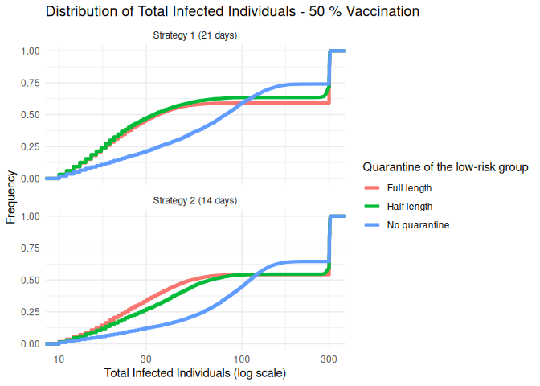
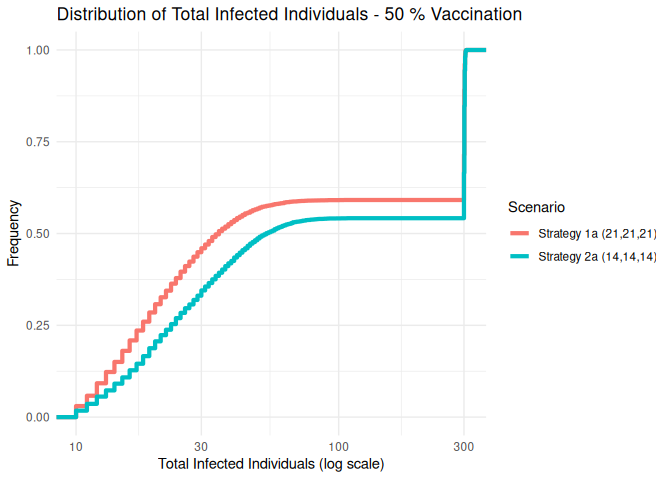

# Measles Tiered Quarantine Simulation – 50% Vaccination
George G. Vega Yon, Ph.D.
2025-10-23

- [Description of the model](#description-of-the-model)
- [Setup](#setup)
- [Scenario: 50% vaccination](#scenario-50-vaccination)

> [!CAUTION]
> This project is a work in progress. Use it at your own risk. **This model simulates a single school, so community transmission is not included**.

> [!IMPORTANT]
> The model makes several assumptions that may not hold in real-world scenarios. One important assumption is that interactions between agents are based solely on class assignments, and not based on friendship networks or other social structures. This assumption reflects strongly in the effect of mid-risk quarantine (see below for more details).

## Description of the model

We are using the `ModelMeaslesMixingRiskQuarantine()` model from the
`epiworldR` package (version 0.10.0.0 or higher). This model uses a
mixing matrix to represent how agents’ interactions are distributed. In
this case, groups represent classrooms in a school, so kids will have
more interactions with kids in their own class than with kids from other
classes.

The model contains the full disease progression for measles, including
the incubation period, prodromal phase, and rash phase. The model
assumes that kids in the rash phase are isolated from their peers.
Nonetheless, the model is calibrated to reflect the measles
$\mathcal{R}_0$ of 15, so kids are infectious during the prodromal
period. Agents can also become hospitalized.

The quarantine process is triggered when an agent is detected during the
rash period. This could occur for more than one agent in the same step.
Quarantine process only applies to unvaccinated agents, and the duration
of quarantine depends on the risk level of the agent, as defined below.

## Setup

This document illustrates an experiment using the `epiworldR` package to
simulate measles transmission under a tiered quarantine strategy. In the
tier quarantine system, agents have different quarantine durations as a
function of their risk level, which are defined as follows:

- **High risk**: Agents in the same classroom as an infected individual.
- **Medium risk**: Agents who were not in the same classroom as the
  infected individual, but were in direct contact with them.
- **Low risk**: Agents who were not in the same classroom or direct
  contact with the infected individual.

Quarantine only applies to unvaccinated agents. The simulation settings
are as follows:

- Individual school with 600 students distributed across 20 classes (30
  students per class).
- The contact rate is given by our previous estimates for within-class
  and between-class interactions: 83% of contacts occur within the same
  class, while 17% occur between different classes.
- The basic reproduction number (R0) is set to 15, reflecting the high
  transmissibility of measles.
- Contact tracing is assumed to be 100% effective, as agents’
  willingness to isolate and quarantine.

The following code block sets up some of the simulation parameters,
including sourcing the simulator function in the file
[`simulator.R`](./simulator.R):

    Loading required package: epiworldR

    Thank you for using epiworldR! Please consider citing it in your work.
    You can find the citation information by running
      citation("epiworldR")

The particular disease parameters for measles, including the mixing
matrix that will be used for the simulation, are defined as follows:

We will test the model using the following scenarios:

- 50%, 80%, and 95% vaccination coverage.
- Quarantine days set to 0, 7, 14, and 21 days.

To assess the risk effect between different quarantine strategies, we
report the probability of observing outbreaks of various sizes rather
than means and medians. Specifically, we calculate:

- $P(\geq 10)$: Probability that an outbreak reaches 10 or more infected
  individuals
- $P(\geq 20)$: Probability that an outbreak reaches 20 or more infected
  individuals
- $P(\geq 50)$: Probability that an outbreak reaches 50 or more infected
  individuals

This approach provides a clearer picture of the distribution’s tail
behavior and allows for better comparison of risk across different
strategies.

## Scenario: 50% vaccination

For this scenario, we simulate with 50% vaccination coverage and compare
the following tiered quarantine strategies:

- Baseline: No quarantine.
- Stragety 1a: 21 days for all risk levels.
- Strategy 1b: 21 days for high and medium risk, 14 days for low risk.
- Strategy 1c: 21 days for high and medium risk, 0 days for low risk.
- Strategy 2a: 14 days for all levels.
- Strategy 2b: 14 days for high and medium risk, 7 days for low risk.
- Strategy 2c: 14 days for high and medium risk, 0 days for low risk.

| Scenario               | P(\>=10) | P(\>=50) | P(\>=100) |
|:-----------------------|:---------|:---------|:----------|
| Strategy 1a (21,21,21) | 0.70     | 0.30     | 0.29      |
| Strategy 1b (21,21,14) | 0.70     | 0.29     | 0.26      |
| Strategy 1c (21,21,0)  | 0.73     | 0.49     | 0.30      |
| Strategy 2a (14,14,14) | 0.79     | 0.41     | 0.36      |
| Strategy 2b (14,14,7)  | 0.80     | 0.46     | 0.37      |
| Strategy 2c (14,14,0)  | 0.81     | 0.65     | 0.45      |
| Baseline (0,0,0)       | 0.95     | 0.95     | 0.92      |

Probability of outbreak sizes across different quarantine scenarios.

We can also create a figure

Same figure but directly comparing strategy 1a vs strategy 2a:

